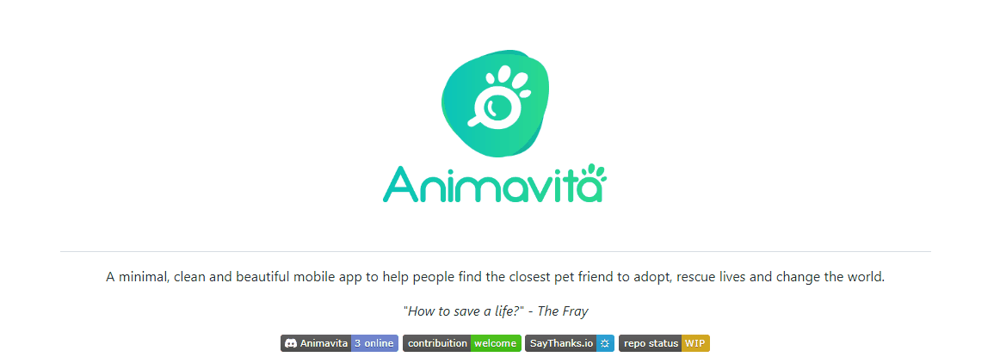

# repositorio-com-redme
# Projeto com Readme
Um projeto de teste com um arquivo README 🤞
[] (https:google.com)


## Tecnologias utilizadas
-HTML
-CSS
-JS

## Como utilizar

Clone pro o projeto

```
git clone
